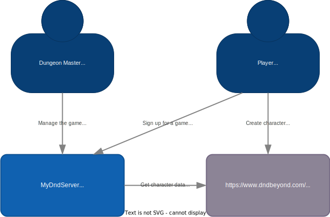
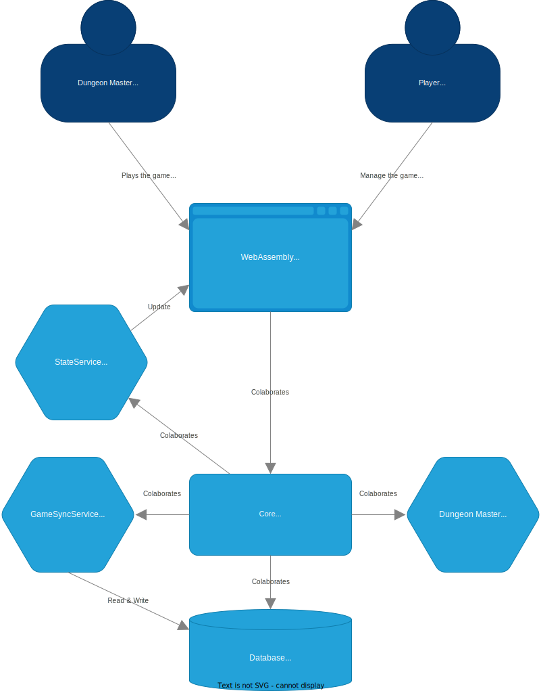

# MyDndServer

Simulate a D&amp;D game in a web application that can handle user with a character from DndBeyond.


## Introduction 

  

Users can create their characters on the D&D Beyond website or mobile application.
Once created they can register their character on MyDndServer.

A dungeonmaster creates a game with characters known in MyDndServer.
Once game is created en started the players can join.

  


## Notes

With following GET request we can aquire the character details
```
https://character-service.dndbeyond.com/character/v5/character/$char_id?includeCustomItems=true
```
- ***$char_id*** is to be replaced with the actual character id from dndbeyond.com


# TODO
>- setup emscripted for web assembly
>- Create data structures
>    - PlayerData
>    - MapData
>    - GameData
>    - Dungeon Master data
>- Setup database
>    - structure
>    - procedures
>    - migration
>- Create Conrollers
>    - DatabaseController
>    - PlayerController
>    - MapController
>    - DiceController
>    - DungeonMasterController
>- Create Services
>    - GameSyncService
>    - DungeonMasterListner
>    - StateService
>- View's
>    - CharacterView
>    - MapView
>    - DiceView
>    - ActionView
>    - DialogeView
>- Create Widgets
>    - PlayerWidget
>    - MapWidget
>    - DiceWidget
>    - ActionWidget
>- Git Guud?!
>- ..
>- profit
