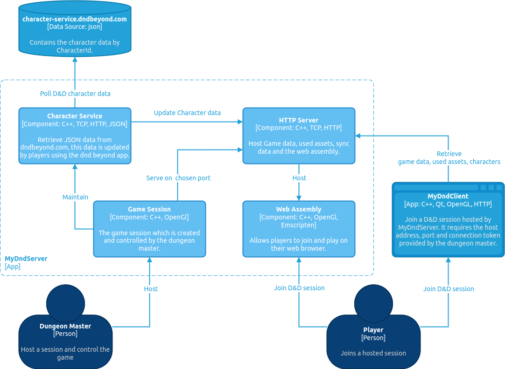

# Overview

Simulate a D&amp;D game running on an **HTTP** server, allowing the host to build and serve their games without the need for an actual server. A hosted game maintains a list of **DndBeyond Charecter id's**, originating from the players that created their character on [the D&D Beyond website.](https://www.dndbeyond.com/characters) 

Users can create their characters on the D&D Beyond website or mobile application. Once created a MyDndServer game session can be hosted, players can join by a temporary token provided ba a game master. Players can use the included **MyDndClient application** on PC or **join via web**, both require an address and port provided by the host.

# Using the server



## Setup a game
:memo: TODO

## Joining a session
:memo: TODO

# Remarks

With following GET request we can aquire the character details

```
https://character-service.dndbeyond.com/character/v5/character/103508287?includeCustomItems=true

```

> ***103508287*** is the character id from dndbeyond.com 


